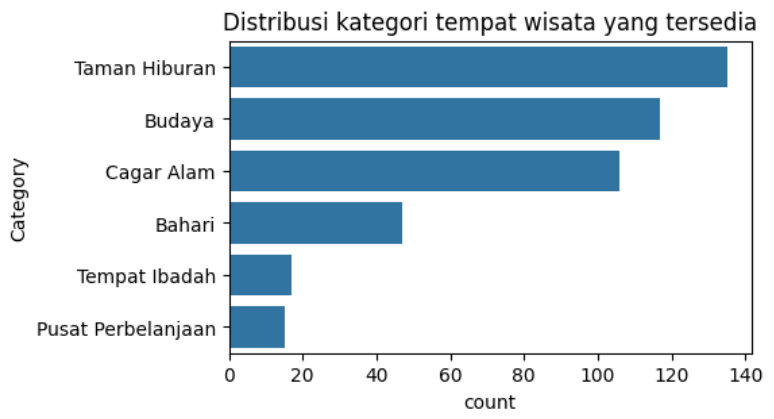
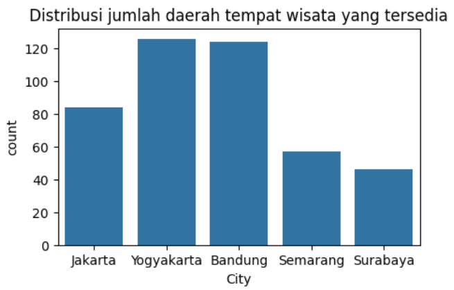
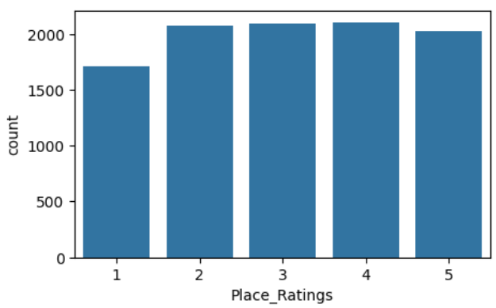

# 🏝️ Sistem Rekomendasi Tempat Wisata: Content-Based & Collaborative Filtering 🏕️

**Author**: Muhamad Fajri Permana Haryanto  
**Category**: Machine Learning – Recommender Systems

---

## 🧠 Project Overview

### 🔎 Latar Belakang

Pariwisata merupakan sektor strategis yang berperan penting dalam pembangunan ekonomi Indonesia. Kontribusinya mencakup peningkatan PDB, penciptaan lapangan kerja, dan distribusi ekonomi antarwilayah. Namun, banyaknya destinasi dari Sabang sampai Merauke justru menimbulkan persoalan baru: wisatawan kerap kesulitan menentukan tujuan wisata yang sesuai preferensi mereka [1].

Dengan kemajuan teknologi digital, sistem rekomendasi menjadi solusi potensial untuk mempersonalisasi pengalaman wisata. Pendekatan _Content-Based Filtering (CBF)_ dan _Collaborative Filtering (CF)_ adalah dua metode utama yang digunakan secara luas [2][3]. Sayangnya, penerapan sistem ini dalam konteks pariwisata lokal masih terbatas.

Melalui proyek ini, dikembangkan sistem rekomendasi destinasi wisata berbasis personalisasi menggunakan kedua pendekatan tersebut, dengan data asli dari Indonesia.

### 🚨 Urgensi Masalah

- Kurangnya personalisasi → rekomendasi cenderung generik dan tidak relevan.
- Minimnya eksposur untuk destinasi lokal non-populer → potensi ekonomi dan budaya belum optimal.
- Meningkatkan kepuasan wisatawan sekaligus mendukung pemerataan pariwisata melalui teknologi cerdas [4].

---

## 🎯 Business Understanding

### 🧩 Problem Statements

1. Bagaimana membangun sistem rekomendasi tempat wisata berbasis _Content-Based Filtering_?
2. Bagaimana menerapkan _Collaborative Filtering_ untuk menyarankan wisata berdasarkan pola pengguna lain?
3. Bagaimana membandingkan performa CBF dan CF pada data wisata Indonesia?

### 🎯 Goals

- Mengembangkan model rekomendasi berbasis konten (CBF) menggunakan fitur-fitur deskriptif destinasi.
- Mengembangkan model _Collaborative Filtering_ menggunakan data interaksi pengguna.
- Mengevaluasi performa kedua model dengan metrik **RMSE**.

---

## 🧪 Solution Approach

### 🧷 Content-Based Filtering (CBF)

- Representasi teks: **TF-IDF vectorizer** pada fitur seperti deskripsi, kategori, lokasi.
- Hitung kesamaan antar destinasi menggunakan **Cosine Similarity**.
- Bangun _user profile_ dari destinasi yang pernah disukai.
- Rekomendasi diberikan berdasarkan kemiripan konten.

### 🧷 Collaborative Filtering (CF)

- Menggunakan algoritma **User-User** atau **Item-Item Similarity**.
- Mengimplementasikan **Singular Value Decomposition (SVD)** untuk mengurangi _data sparsity_.
- Prediksi rating destinasi yang belum pernah dilihat pengguna berdasarkan pola pengguna lain.

---

## 📊 Data Understanding

🔗 Sumber Data
Dataset yang digunakan dalam proyek ini diperoleh dari Kaggle:
**Dataset**: [Indonesia Tourism Destination - Kaggle](https://www.kaggle.com/datasets/aprabowo/indonesia-tourism-destination)

Dataset ini terdiri dari dua file utama:

        tourism_with_id.csv: berisi informasi detail mengenai tempat wisata.
        tourism_rating.csv: berisi data rating dari pengguna terhadap tempat wisata.

### 📁 Struktur Dataset

#### 🏞️ Destinations Dataset (tourism_with_id.csv)

Berisi 437 baris dan 13 kolom. Berikut deskripsi variabelnya:

| Kolom            | Deskripsi                                                      |
| ---------------- | -------------------------------------------------------------- |
| `Place_Id`       | ID unik dari tempat wisata                                     |
| `Place_Name`     | Nama tempat wisata                                             |
| `Description`    | Deskripsi singkat tempat                                       |
| `Category`       | Kategori tempat wisata (Budaya, Alam, dll.)                    |
| `City`           | Kota di mana tempat wisata berada                              |
| `Price`          | Harga tiket masuk (dalam Rupiah)                               |
| `Rating`         | Rata-rata rating dari pengguna                                 |
| `Time_Minutes`   | Estimasi waktu yang dibutuhkan untuk berwisata (dalam menit)   |
| `Coordinate`     | Format dictionary (lat, long)                                  |
| `Lat`, `Long`    | Koordinat geografis dalam bentuk float                         |
| `Unnamed: 11/12` | Kolom tidak relevan, akan dibersihkan pada tahap preprocessing |

#### ⭐ Reviews Dataset (tourism_rating.csv)

Berisi 10.000 baris dan 3 kolom.

| Kolom           | Deskripsi                                              |
| --------------- | ------------------------------------------------------ |
| `User_Id`       | ID pengguna                                            |
| `Place_Id`      | ID tempat wisata (relasi dengan `tourism_with_id.csv`) |
| `Place_Ratings` | Skor rating dari pengguna (1–5)                        |

### 📌 Ringkasan Statistik Awal

- Jumlah tempat wisata: 437
- Jumlah kota/tempat berbeda: 5 kota
- Jumlah kategori wisata: 6 kategori
- Jumlah user yang melakukan review: 300
- Jumlah data rating pengguna: 10.000

### 📈 Visualisasi Awal (EDA)

---

## 🧹 Data Preparation

Tahapan ini bertujuan untuk mempersiapkan data mentah agar siap digunakan dalam proses analisis dan pemodelan rekomendasi. Teknik-teknik yang diterapkan dijelaskan secara berurutan sesuai praktik di notebook.

### 📌 1. Pemeriksaan Jumlah Data Wisata

Langkah pertama adalah memastikan jumlah data tempat wisata yang tersedia dalam dataset:

        len(Destinations_df)

Output: 437

📍 Kesimpulan: Dataset Destinations_df berisi 437 tempat wisata.

### 🚨 2. Pemeriksaan Missing Value

Diperiksa jumlah nilai kosong (missing) di kedua dataset:

        Destinations_df.isnull().sum()

📊 Hasil:

| Kolom        | Jumlah Nilai Kosong |
| ------------ | ------------------- |
| Place_Id     | 0                   |
| Place_Name   | 0                   |
| Description  | 0                   |
| Category     | 0                   |
| City         | 0                   |
| Price        | 0                   |
| Rating       | 0                   |
| Time_Minutes | 232                 |
| Coordinate   | 0                   |
| Lat          | 0                   |
| Long         | 0                   |
| Unnamed: 11  | 437                 |
| Unnamed: 12  | 0                   |

         Reviews_df.isnull().sum()

📊 Hasil:

| Kolom         | Jumlah Nilai Kosong |
| ------------- | ------------------- |
| User_Id       | 0                   |
| Place_Id      | 0                   |
| Place_Ratings | 0                   |

Untuk kolom Destinations*df karena terdapat \_missing value* pada kolom **Time_Minutes = 232**, dan **Unnamed: 11 = 437**, maka diputuskan untuk menghapus/menghilangkan kolom yang ada _missing value_ tersebut, dikarenakan kolom tersebut setelah dipertimbang kurang relavan juga dengan tujuan penelitian ini, selain itu diputuskan juga untuk menghapus beberapa kolom yang tidak relevan agar bisa lebih sesuai tujuan penelitian untuk tidak digunakan dalam analisis rekomendasi, dan penghapusan kolom ini bisa membuat model lebih optimal kedepannya.

        Destinations_df.drop(['Time_Minutes', 'Coordinate', 'Lat', 'Long', 'Unnamed: 11', 'Unnamed: 12'], axis=1, inplace=True)

### 🔁 3. Pemeriksaan dan Penghapusan Duplikasi

Data duplikat diperiksa dan dihapus untuk memastikan tidak terjadi bias atau redundansi.

        print("Duplikat destinasi:", Destinations_df.duplicated().sum())
        print("Duplikat review:", Reviews_df.duplicated().sum())

📍 Hasil:

- Duplikat pada Destinations_df: 0
- Duplikat pada Reviews_df: 79, seluruhnya dihapus

        Reviews_df.drop_duplicates(inplace=True)

### 🔄 4. Konversi Series Menjadi List

Langkah ini bertujuan untuk mempermudah manipulasi data dan pembuatan struktur baru.

        tour_id = Destinations_df['Place_Id'].tolist()
        tour_name = Destinations_df['Place_Name'].tolist()
        tour_category = Destinations_df['Category'].tolist()

📍 Jumlah item pada masing-masing list: 437

### 🧱 5. Membuat Dictionary Dataset

Dictionary baru dibuat untuk menyederhanakan proses pemetaan dan pengelompokan data wisata berdasarkan ID, nama, dan kategori:

        tour_df = pd.DataFrame({
            'id': tour_id,
            'tour_name': tour_name,
            'category': tour_category
        })

📌 Contoh Output:

| id  | tour_name                        | category      |
| --- | -------------------------------- | ------------- |
| 1   | Monumen Nasional                 | Budaya        |
| 2   | Kota Tua                         | Budaya        |
| 3   | Dunia Fantasi                    | Taman Hiburan |
| …   | …                                | …             |
| 437 | Gereja Perawan Maria Tak Berdosa | Tempat Ibadah |

---

## 📦 Modeling

### Content-Based Filtering

#### 1. Data Preparation

Sebelum masuk ke tahap modeling, dilakukan beberapa tahapan data preparation untuk memastikan data siap digunakan dalam proses Content-Based Filtering.

##### ✅ Langkah-Langkah Data Preparation:

a. Cross-Check Variabel

Langkah awal adalah memastikan dataset yang digunakan telah bersih dan terstruktur. Berikut contoh sampling data untuk pengecekan:

        data = tour_df
        data.sample(5)

| id  | tour_name                            | category      |
| --- | ------------------------------------ | ------------- |
| 256 | Wisata Batu Kuda                     | Cagar Alam    |
| 430 | Atlantis Land Surabaya               | Taman Hiburan |
| 194 | Pantai Wediombo                      | Bahari        |
| 259 | Monumen Perjuangan Rakyat Jawa Barat | Budaya        |
| 95  | Desa Wisata Sungai Code Jogja Kota   | Taman Hiburan |

Dari data ini terlihat bahwa fitur category akan menjadi dasar dari proses rekomendasi berbasis konten.

#### 2. Modeling

##### Content-Based Filtering

Pada tahap ini, dilakukan pemodelan sistem rekomendasi menggunakan pendekatan Content-Based Filtering, yaitu dengan merekomendasikan item yang memiliki kemiripan konten (kategori) dengan item yang dipilih oleh pengguna.

###### 🔧 a. TF-IDF Vectorization

Digunakan TfidfVectorizer dari scikit-learn untuk mengubah teks kategori menjadi vektor numerik.

        from sklearn.feature_extraction.text import TfidfVectorizer

        tf = TfidfVectorizer()
        tfidf_matrix = tf.fit_transform(data['category'])

- Jumlah data: 437 destinasi wisata
- Jumlah fitur unik dari kategori: 10

        tf.get_feature_names_out()

Output:
['alam', 'bahari', 'budaya', 'cagar', 'hiburan', 'ibadah','perbelanjaan', 'pusat', 'taman', 'tempat']

Representasi hasil TF-IDF dapat divisualisasikan sebagai DataFrame (contoh pengambilan acak):

        pd.DataFrame(
            tfidf_matrix.todense(),
            columns=tf.get_feature_names_out(),
            index=data.tour_name
        ).sample(10)

(Catatan: Matriks penuh tidak ditampilkan karena kompleks dan besar. Ini hanya ilustrasi representatif.)

###### 🤝 b. Cosine Similarity

Setelah mendapatkan representasi vektor, langkah selanjutnya adalah menghitung tingkat kemiripan antar wisata menggunakan Cosine Similarity.

        from sklearn.metrics.pairwise import cosine_similarity

        cosine_sim = cosine_similarity(tfidf_matrix)
        cosine_sim_df = pd.DataFrame(cosine_sim, index=data['tour_name'], columns=data['tour_name'])

- Ukuran matriks kemiripan: (437, 437)
- Nilai 1 menunjukkan wisata yang berada pada kategori yang sama.

###### 📌 c. Alasan Menggunakan TF-IDF + Cosine Similarity

- TF-IDF digunakan karena mampu menangkap term significance dalam data kategori pendek.
- Cosine Similarity efektif mengukur kemiripan antara vektor fitur tanpa terpengaruh oleh panjang teks.

##### 3. Implementasi Model Rekomendasi

🔍 Cara Kerja Singkat

###### 🧾 1. Input: Nama Tempat Wisata

Pengguna cukup memasukkan nama tempat wisata yang pernah dikunjungi. Nama ini akan digunakan sebagai query utama untuk mencari tempat-tempat serupa.

        place_index = items[items['tour_name'].str.lower() == place_name.lower()].index
        if len(place_index) == 0:
            print(f"Tempat wisata dengan nama '{place_name}' tidak ditemukan.")
            return pd.DataFrame()

###### ⚙️ 2. Proses: Mencari Kemiripan dan Evaluasi

- Hitung kemiripan antara tempat input dan semua tempat lain menggunakan Cosine Similarity.
- Lalu ambil sejumlah top_k tempat paling mirip (kecuali tempat input).
- Evaluasi kesamaan kategori (optional metric: Precision@K).

        sim_scores = list(enumerate(similarity_data.iloc[place_index[0]]))
        sim_scores = sorted(sim_scores, key=lambda x: x[1], reverse=True)[1:top_k + 1]
        place_indices = [i[0] for i in sim_scores]

        recommendations = items.iloc[place_indices].copy()
        recommendations['similarity_score'] = [i[1] for i in sim_scores]

**Evaluasi kesamaan kategori**

        query_categories = set(data.loc[place_index[0], 'category'].lower().replace(", ", ",").split(","))
        total_overlap = 0
        category_counts = []

        for _, row in recommendations.iterrows():
            rec_categories = set(row['category'].lower().replace(", ", ",").split(","))
            overlap = query_categories.intersection(rec_categories)
            total_overlap += len(overlap)
            category_counts.append(len(rec_categories))

        precision_at_k = total_overlap / sum(category_counts) if category_counts else 0

###### 📤 3. Output: Daftar Rekomendasi Tempat Wisata

Output berupa tabel rekomendasi tempat wisata yang relevan dengan tempat yang dimasukkan sebelumnya. Setiap hasil mencakup nama tempat dan kategorinya.

        display(recommendations[['tour_name', 'category']])

**Contoh Output**

        tour_recommendation("Rabbit Town")

Evaluasi untuk rekomendasi tempat yang mirip 'Rabbit Town':
Tempat wisata yang pernah dikunjungi: Rabbit Town (Kategori: {'taman hiburan'})

Rekomendasi Tempat Wisata Lainnya 5:

| tour_name                         | category      |
| --------------------------------- | ------------- |
| Taman Mini Indonesia Indah (TMII) | Taman Hiburan |
| Atlantis Water Adventure          | Taman Hiburan |
| Taman Impian Jaya Ancol           | Taman Hiburan |
| Ocean Ecopark                     | Taman Hiburan |
| Kidzania                          | Taman Hiburan |

##### Collaborative Filtering
