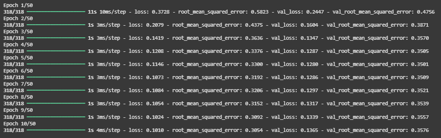
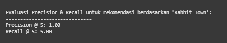

# 🏝️ Sistem Rekomendasi Tempat Wisata: Content-Based & Collaborative Filtering 🏕️

**Author**: Muhamad Fajri Permana Haryanto  
**Category**: Machine Learning – Recommender Systems

---

## 🧠 Project Overview

### 🔎 Latar Belakang

Pariwisata merupakan sektor strategis yang berperan penting dalam pembangunan ekonomi Indonesia. Kontribusinya mencakup peningkatan PDB, penciptaan lapangan kerja, dan distribusi ekonomi antarwilayah. Namun, banyaknya destinasi dari Sabang sampai Merauke justru menimbulkan persoalan baru: wisatawan kerap kesulitan menentukan tujuan wisata yang sesuai preferensi mereka [1].

Dengan kemajuan teknologi digital, sistem rekomendasi menjadi solusi potensial untuk mempersonalisasi pengalaman wisata. Pendekatan _Content-Based Filtering (CBF)_ dan _Collaborative Filtering (CF)_ adalah dua metode utama yang digunakan secara luas [2][3]. Sayangnya, penerapan sistem ini dalam konteks pariwisata lokal masih terbatas.

Melalui proyek ini, dikembangkan sistem rekomendasi destinasi wisata berbasis personalisasi menggunakan kedua pendekatan tersebut, dengan data asli dari Indonesia.

### 🚨 Urgensi Masalah

- Kurangnya personalisasi → rekomendasi cenderung generik dan tidak relevan.
- Minimnya eksposur untuk destinasi lokal non-populer → potensi ekonomi dan budaya belum optimal.
- Meningkatkan kepuasan wisatawan sekaligus mendukung pemerataan pariwisata melalui teknologi cerdas [4].

---

## 🎯 Business Understanding

### 🧩 Problem Statements

1. Bagaimana membangun sistem rekomendasi tempat wisata berbasis _Content-Based Filtering_?
2. Bagaimana menerapkan _Collaborative Filtering_ untuk menyarankan wisata berdasarkan pola pengguna lain?
3. Bagaimana membandingkan performa CBF dan CF pada data wisata Indonesia?

### 🎯 Goals

- Mengembangkan model rekomendasi berbasis konten (CBF) menggunakan fitur-fitur deskriptif destinasi.
- Mengembangkan model _Collaborative Filtering_ menggunakan data interaksi pengguna.
- Mengevaluasi performa kedua model dengan metrik **RMSE**.

---

## 🧪 Solution Approach

### 🧷 Content-Based Filtering (CBF)

- Representasi teks: **TF-IDF vectorizer** pada fitur seperti deskripsi, kategori, lokasi.
- Hitung kesamaan antar destinasi menggunakan **Cosine Similarity**.
- Bangun _user profile_ dari destinasi yang pernah disukai.
- Rekomendasi diberikan berdasarkan kemiripan konten.

### 🧷 Collaborative Filtering (CF)

- Menggunakan algoritma **User-User** atau **Item-Item Similarity**.
- Mengimplementasikan **Singular Value Decomposition (SVD)** untuk mengurangi _data sparsity_.
- Prediksi rating destinasi yang belum pernah dilihat pengguna berdasarkan pola pengguna lain.

---

## 📊 Data Understanding

🔗 Sumber Data
Dataset yang digunakan dalam proyek ini diperoleh dari Kaggle:
**Dataset**: [Indonesia Tourism Destination - Kaggle](https://www.kaggle.com/datasets/aprabowo/indonesia-tourism-destination)

Dataset ini terdiri dari dua file utama:

        tourism_with_id.csv: berisi informasi detail mengenai tempat wisata.
        tourism_rating.csv: berisi data rating dari pengguna terhadap tempat wisata.

### 📁 Struktur Dataset

#### 🏞️ Destinations Dataset (tourism_with_id.csv)

Berisi 437 baris dan 13 kolom. Berikut deskripsi variabelnya:

| Kolom            | Deskripsi                                                      |
| ---------------- | -------------------------------------------------------------- |
| `Place_Id`       | ID unik dari tempat wisata                                     |
| `Place_Name`     | Nama tempat wisata                                             |
| `Description`    | Deskripsi singkat tempat                                       |
| `Category`       | Kategori tempat wisata (Budaya, Alam, dll.)                    |
| `City`           | Kota di mana tempat wisata berada                              |
| `Price`          | Harga tiket masuk (dalam Rupiah)                               |
| `Rating`         | Rata-rata rating dari pengguna                                 |
| `Time_Minutes`   | Estimasi waktu yang dibutuhkan untuk berwisata (dalam menit)   |
| `Coordinate`     | Format dictionary (lat, long)                                  |
| `Lat`, `Long`    | Koordinat geografis dalam bentuk float                         |
| `Unnamed: 11/12` | Kolom tidak relevan, akan dibersihkan pada tahap preprocessing |

#### ⭐ Reviews Dataset (tourism_rating.csv)

Berisi 10.000 baris dan 3 kolom.

| Kolom           | Deskripsi                                              |
| --------------- | ------------------------------------------------------ |
| `User_Id`       | ID pengguna                                            |
| `Place_Id`      | ID tempat wisata (relasi dengan `tourism_with_id.csv`) |
| `Place_Ratings` | Skor rating dari pengguna (1–5)                        |

### 📌 Ringkasan Statistik Awal

- Jumlah tempat wisata: 437
- Jumlah kota/tempat berbeda: 5 kota
- Jumlah kategori wisata: 6 kategori
- Jumlah user yang melakukan review: 300
- Jumlah data rating pengguna: 10.000

### 📈 Visualisasi Awal (EDA)

---

## 🧹 Data Preparation

Tahapan ini bertujuan untuk mempersiapkan data mentah agar siap digunakan dalam proses analisis dan pemodelan rekomendasi. Teknik-teknik yang diterapkan dijelaskan secara berurutan sesuai praktik di notebook.

### 📌 1. Pemeriksaan Jumlah Data Wisata

Langkah pertama adalah memastikan jumlah data tempat wisata yang tersedia dalam dataset:

        len(Destinations_df)

Output: 437

📍 Kesimpulan: Dataset Destinations_df berisi 437 tempat wisata.

### 🚨 2. Pemeriksaan Missing Value

Diperiksa jumlah nilai kosong (missing) di kedua dataset:

        Destinations_df.isnull().sum()

📊 Hasil:

| Kolom        | Jumlah Nilai Kosong |
| ------------ | ------------------- |
| Place_Id     | 0                   |
| Place_Name   | 0                   |
| Description  | 0                   |
| Category     | 0                   |
| City         | 0                   |
| Price        | 0                   |
| Rating       | 0                   |
| Time_Minutes | 232                 |
| Coordinate   | 0                   |
| Lat          | 0                   |
| Long         | 0                   |
| Unnamed: 11  | 437                 |
| Unnamed: 12  | 0                   |

         Reviews_df.isnull().sum()

📊 Hasil:

| Kolom         | Jumlah Nilai Kosong |
| ------------- | ------------------- |
| User_Id       | 0                   |
| Place_Id      | 0                   |
| Place_Ratings | 0                   |

Untuk kolom Destinations*df karena terdapat \_missing value* pada kolom **Time_Minutes = 232**, dan **Unnamed: 11 = 437**, maka diputuskan untuk menghapus/menghilangkan kolom yang ada _missing value_ tersebut, dikarenakan kolom tersebut setelah dipertimbang kurang relavan juga dengan tujuan penelitian ini, selain itu diputuskan juga untuk menghapus beberapa kolom yang tidak relevan agar bisa lebih sesuai tujuan penelitian untuk tidak digunakan dalam analisis rekomendasi, dan penghapusan kolom ini bisa membuat model lebih optimal kedepannya.

        Destinations_df.drop(['Time_Minutes', 'Coordinate', 'Lat', 'Long', 'Unnamed: 11', 'Unnamed: 12'], axis=1, inplace=True)

### 🔁 3. Pemeriksaan dan Penghapusan Duplikasi

Data duplikat diperiksa dan dihapus untuk memastikan tidak terjadi bias atau redundansi.

        print("Duplikat destinasi:", Destinations_df.duplicated().sum())
        print("Duplikat review:", Reviews_df.duplicated().sum())

📍 Hasil:

- Duplikat pada Destinations_df: 0
- Duplikat pada Reviews_df: 79, seluruhnya dihapus

        Reviews_df.drop_duplicates(inplace=True)

### 🔄 4. Konversi Series Menjadi List

Langkah ini bertujuan untuk mempermudah manipulasi data dan pembuatan struktur baru.

        tour_id = Destinations_df['Place_Id'].tolist()
        tour_name = Destinations_df['Place_Name'].tolist()
        tour_category = Destinations_df['Category'].tolist()

📍 Jumlah item pada masing-masing list: 437

### 🧱 5. Membuat Dictionary Dataset

Dictionary baru dibuat untuk menyederhanakan proses pemetaan dan pengelompokan data wisata berdasarkan ID, nama, dan kategori:

        tour_df = pd.DataFrame({
            'id': tour_id,
            'tour_name': tour_name,
            'category': tour_category
        })

📌 Contoh Output:

| id  | tour_name                        | category      |
| --- | -------------------------------- | ------------- |
| 1   | Monumen Nasional                 | Budaya        |
| 2   | Kota Tua                         | Budaya        |
| 3   | Dunia Fantasi                    | Taman Hiburan |
| …   | …                                | …             |
| 437 | Gereja Perawan Maria Tak Berdosa | Tempat Ibadah |

---

## 📦 Modeling

### Content-Based Filtering

#### 1. Data Preparation

Cross-Check Variabel

Langkah awal adalah memastikan dataset yang digunakan telah bersih dan terstruktur. Berikut contoh sampling data untuk pengecekan:

        data = tour_df
        data.sample(5)

| id  | tour_name                            | category      |
| --- | ------------------------------------ | ------------- |
| 256 | Wisata Batu Kuda                     | Cagar Alam    |
| 430 | Atlantis Land Surabaya               | Taman Hiburan |
| 194 | Pantai Wediombo                      | Bahari        |
| 259 | Monumen Perjuangan Rakyat Jawa Barat | Budaya        |
| 95  | Desa Wisata Sungai Code Jogja Kota   | Taman Hiburan |

Dari data ini terlihat bahwa fitur category akan menjadi dasar dari proses rekomendasi berbasis konten.

#### 2. Modeling Content-Based Filtering

Pada tahap ini, dilakukan pemodelan sistem rekomendasi menggunakan pendekatan Content-Based Filtering, yaitu dengan merekomendasikan item yang memiliki kemiripan konten (kategori) dengan item yang dipilih oleh pengguna.

##### 🔧 a. TF-IDF Vectorization

Digunakan TfidfVectorizer dari scikit-learn untuk mengubah teks kategori menjadi vektor numerik.

        from sklearn.feature_extraction.text import TfidfVectorizer

        tf = TfidfVectorizer()
        tfidf_matrix = tf.fit_transform(data['category'])

- Jumlah data: 437 destinasi wisata
- Jumlah fitur unik dari kategori: 10

        tf.get_feature_names_out()

Output:
['alam', 'bahari', 'budaya', 'cagar', 'hiburan', 'ibadah','perbelanjaan', 'pusat', 'taman', 'tempat']

##### 🤝 b. Cosine Similarity

Setelah mendapatkan representasi vektor, langkah selanjutnya adalah menghitung tingkat kemiripan antar wisata menggunakan Cosine Similarity.

        cosine_sim = cosine_similarity(tfidf_matrix)
        cosine_sim_df = pd.DataFrame(cosine_sim, index=data['tour_name'], columns=data['tour_name'])

- Ukuran matriks kemiripan: (437, 437)
- Nilai 1 menunjukkan wisata yang berada pada kategori yang sama.

##### 📌 c. Alasan Menggunakan TF-IDF + Cosine Similarity

- TF-IDF digunakan karena mampu menangkap term significance dalam data kategori pendek.
- Cosine Similarity efektif mengukur kemiripan antara vektor fitur tanpa terpengaruh oleh panjang teks.

#### 3. Implementasi Model Rekomendasi

🔍 Cara Kerja Singkat

##### 🧾 1. Input: Nama Tempat Wisata

Pengguna cukup memasukkan nama tempat wisata yang pernah dikunjungi. Nama ini akan digunakan sebagai query utama untuk mencari tempat-tempat serupa.

        place_index = items[items['tour_name'].str.lower() == place_name.lower()].index
        if len(place_index) == 0:
            print(f"Tempat wisata dengan nama '{place_name}' tidak ditemukan.")
            return pd.DataFrame()

##### ⚙️ 2. Proses: Mencari Kemiripan dan Evaluasi

- Hitung kemiripan antara tempat input dan semua tempat lain menggunakan Cosine Similarity.
- Lalu ambil sejumlah top_k tempat paling mirip (kecuali tempat input).
- Evaluasi kesamaan kategori

        sim_scores = list(enumerate(similarity_data.iloc[place_index[0]]))
        sim_scores = sorted(sim_scores, key=lambda x: x[1], reverse=True)[1:top_k + 1]
        place_indices = [i[0] for i in sim_scores]

        recommendations = items.iloc[place_indices].copy()
        recommendations['similarity_score'] = [i[1] for i in sim_scores]

**Evaluasi kesamaan kategori**

        query_categories = set(data.loc[place_index[0], 'category'].lower().replace(", ", ",").split(","))
        total_overlap = 0
        category_counts = []

        for _, row in recommendations.iterrows():
            rec_categories = set(row['category'].lower().replace(", ", ",").split(","))
            overlap = query_categories.intersection(rec_categories)
            total_overlap += len(overlap)
            category_counts.append(len(rec_categories))

        precision_at_k = total_overlap / sum(category_counts) if category_counts else 0

##### 📤 3. Output: Daftar Rekomendasi Tempat Wisata

Output berupa tabel rekomendasi tempat wisata yang relevan dengan tempat yang dimasukkan sebelumnya. Setiap hasil mencakup nama tempat dan kategorinya.

**Contoh Penenrapan dan pengunaan**

        tour_recommendation("Rabbit Town")

Evaluasi untuk rekomendasi tempat yang mirip 'Rabbit Town':
Tempat wisata yang pernah dikunjungi: Rabbit Town (Kategori: {'taman hiburan'})

Rekomendasi Tempat Wisata Lainnya 5:

| tour_name                         | category      |
| --------------------------------- | ------------- |
| Taman Mini Indonesia Indah (TMII) | Taman Hiburan |
| Atlantis Water Adventure          | Taman Hiburan |
| Taman Impian Jaya Ancol           | Taman Hiburan |
| Ocean Ecopark                     | Taman Hiburan |
| Kidzania                          | Taman Hiburan |

### Collaborative Filtering

Collaborative Filtering memanfaatkan interaksi pengguna (review/rating) terhadap tempat wisata untuk memberikan rekomendasi yang personal. Sistem ini dirancang untuk menangkap pola preferensi pengguna dan menyarankan tempat baru berdasarkan user-user serupa.

#### 📦 1. Data Loading

Langkah awal adalah memuat dataset Reviews_df, yaitu kumpulan ulasan pengguna terhadap berbagai tempat wisata. Data ini berisi User_Id, Place_Id, dan Place_Ratings.

        user = Reviews_df
        user

| User_Id | Place_Id | Place_Ratings |
| ------- | -------- | ------------- |
| 1       | 179      | 3             |
| 1       | 344      | 2             |
| 1       | 5        | 5             |
| ...     | ...      | ...           |

#### 🧹 2. Data Preparation

Tahap ini bertujuan untuk mempersiapkan data agar bisa digunakan dalam model, terutama melakukan encoding (mengubah ID ke bentuk numerik).

Langkah-langkah:

1. Ambil daftar unik User_Id & Place_Id
   -> Menghindari duplikasi dan memudahkan encoding.

2. Encoding User_Id dan Place_Id
   -> Mengubah ID asli menjadi angka unik dari 0 hingga N.

3. Mapping ke DataFrame
   -> Menambahkan kolom USER dan TOUR sebagai hasil encoding.

📋 Output (Setelah Mapping):

| User_Id | Place_Id | Place_Ratings | USER | TOUR |
| ------- | -------- | ------------- | ---- | ---- |
| 1       | 179      | 3             | 0    | 0    |
| 1       | 344      | 2             | 0    | 1    |
| 1       | 5        | 5             | 0    | 2    |
| ...     | ...      | ...           | ...  | ...  |

#### 🛠️ 3. Training and Validation Process

Setelah data siap, langkah berikutnya adalah melatih model menggunakan data tersebut. Proses training meliputi beberapa tahap:

- Split data menjadi 80% untuk training dan 20% untuk validasi untuk menjaga model tidak overfit dan dapat generalisasi dengan baik.
- Normalisasi rating agar nilai rating berada dalam skala 0 sampai 1, memudahkan proses pembelajaran model.
- Membentuk input x berupa pasangan (USER, TOUR) dan target y berupa rating yang sudah dinormalisasi.

#### 🧠 4. Building Neural Collaborative Filtering Model

Model yang digunakan adalah Neural Network sederhana dengan embedding layers untuk user dan tour (tempat wisata). Struktur inti model:

- Embedding layers untuk user dan tour mengubah ID diskrit menjadi representasi vektor kontinu.
- Bias embeddings untuk menangkap kecenderungan rating khusus user dan tempat.
- Dot product antara embedding user dan tour sebagai prediksi dasar rating.
- Dropout dan batch normalization untuk mencegah overfitting dan menjaga kestabilan training.

Model dikompilasi dengan fungsi loss Mean Squared Error dan optimasi menggunakan Adam dengan learning rate rendah (0.0005) agar training stabil.

        model.compile(
        loss=tf.keras.losses.MeanSquaredError(),
        optimizer = tf.keras.optimizers.Adam(learning_rate=0.0005),
        metrics=[tf.keras.metrics.RootMeanSquaredError()]
        )

Dilakukan pelatihan dengan batch size 20 selama maksimal 50 epoch dengan early stopping (jika validasi loss tidak membaik selama 5 epoch, training dihentikan untuk mencegah overfitting).

Sehingga didapati :

Hasil epoch menunjukkan tren yang baik dengan penurunan nilai loss dan root_mean_squared_error (RMSE) seiring bertambahnya epoch yang mengindikasikan model belajar dengan baik. Namun, val_loss dan val_root_mean_squared_error (val_RMSE) cenderung stabil setelah epoch ke-5, bahkan sedikit meningkat di epoch terakhir, menunjukkan potensi overfitting. Secara keseluruhan, model ini menunjukkan performa yang baik pada data pelatihan, tetapi perlu diwaspadai potensi overfitting pada data validasi.

## 🗳️5. Evaluation

Proses evaluasi dilakukan secara menyeluruh, dimulai dari analisis performa model selama pelatihan hingga pengujian sistem rekomendasi terhadap data nyata. Tujuan dari tahap ini adalah untuk memastikan bahwa model collaborative filtering tidak hanya bekerja baik secara teori, tetapi juga mampu memberikan rekomendasi yang relevan dan akurat kepada pengguna.

### Evaluasi Performa Model (Training Metrics)

Model dievaluasi menggunakan metrik Root Mean Squared Error (RMSE), yang digunakan untuk mengukur seberapa besar selisih antara prediksi model dengan data aktual. RMSE dihitung menggunakan rumus berikut:

        RMSE = sqrt( (1/n) * Σ (y_i - ŷ_i)^2 )

Nilai RMSE yang lebih rendah menunjukkan prediksi model yang lebih akurat. Berdasarkan grafik pelatihan, terlihat bahwa nilai RMSE pada data pelatihan dan pengujian awalnya cukup tinggi, namun keduanya mengalami penurunan signifikan hingga sekitar epoch ke-2. Setelah titik tersebut, nilai RMSE pada data pelatihan terus menurun, sementara RMSE pada data pengujian mulai stabil dan cenderung sedikit meningkat.

Perbedaan nilai RMSE yang cukup besar antara data pelatihan dan pengujian setelah epoch ke-2 menunjukkan potensi overfitting, di mana model terlalu menyesuaikan diri dengan data pelatihan namun tidak mampu melakukan generalisasi dengan baik pada data baru. Untuk mengurangi risiko ini, dapat dipertimbangkan penerapan teknik regularisasi atau pengaturan parameter model lebih lanjut.

### Recommendation Testing Collaborative Filtering

Setelah model selesai dilatih, sistem diuji dengan memilih satu pengguna secara acak dari data ulasan (Reviews_df). Tujuan dari pengujian ini adalah untuk mensimulasikan bagaimana sistem memberikan rekomendasi wisata berdasarkan preferensi historis pengguna. Semua tempat yang telah dikunjungi oleh pengguna diidentifikasi terlebih dahulu agar tidak direkomendasikan ulang.

Daftar destinasi yang belum pernah dikunjungi pengguna kemudian diproses dan dikonversi ke format numerik yang sesuai dengan input model. Bersamaan dengan encoding ID pengguna, seluruh pasangan user–tempat diprediksi menggunakan model collaborative filtering:

        predicted_ratings = model.predict(user_place_array).flatten()

Model memberikan skor prediksi terhadap setiap destinasi, lalu sistem mengurutkan hasil tersebut dan memilih 10 destinasi dengan skor tertinggi sebagai rekomendasi baru. Untuk membantu mengevaluasi relevansi, sistem juga menampilkan 5 tempat dengan rating tertinggi yang pernah dikunjungi sebelumnya oleh pengguna tersebut. Perbandingan ini bertujuan untuk melihat apakah rekomendasi yang diberikan sejalan dengan preferensi pengguna di masa lalu.

## Referensi

[1] S. Wang, Z. A. Bhuiyan, H. Peng, and B. Du, "Hybrid deep neural networks for friend recommendations in edge computing environment," IEEE Access, vol. 8, pp. 10693–10706, 2020.
ResearchGate

[2] N. Wayan and P. Yuni, "Designing a tourism recommendation system using a hybrid method (Collaborative filtering and content-based filtering)," in 2021 IEEE International Conference on Communication, Networks and Satellite (COMNETSAT), Purwokerto, Indonesia, 2021, pp. 298–305.
ResearchGate

[3] S. Goel and S. W. A. Rizvi, "Travel Recommendation System Using Content and Collaborative Filtering," Journal of Modern Computing and Engineering, vol. 3, no. 2, pp. 45–52, 2023.
jmce.a2zjournals.com

[4] K. E. Permana, A. B. Rahmat, D. A. Wicaksana, and D. Ardianto, "Collaborative filtering-based Madura Island tourism recommendation system using RecommenderNet," BIO Web of Conferences, vol. 65, 2024.
bio-conferences.org

[5] R. Glauber and A. Loula, "Collaborative Filtering vs. Content-Based Filtering: differences and similarities," arXiv preprint arXiv:1912.08932, 2019.
arXiv
